# ASEapp Surface Builder 操作ガイド

> 対応版: v1.1.x 系 / current public repository UI。
> このガイドは、配置プレビュー、VESTA `SBOND` 風ボンド距離設定、supercell / 真空層 / セル軸傾き、原子一覧 PNG、前駆体配置、吸着分子ポーズ編集まで含む新しい操作版です。まず全体像を掴みたい場合は、画像付きの `README.md` から読むと早いです。

このガイドは、ASEapp Surface Builder で構造ファイルを読み込み、表面 slab / supercell / 真空層 / 吸着原子 / 前駆体配置 / 吸着分子ポーズ編集を行うための実用手順です。スクリーンショットは主に `guide_assets/sample_GaN.cif` を読み込んだ Windows 版の例です。吸着分子ポーズ編集の例では、実分子サンプル `code/native_ui/assets/samples/adsorbate_pose_methanol_on_cu.extxyz` も使っています。

## 0. まず覚える標準ワークフロー

1. `開く` またはドラッグ&ドロップで構造ファイルを読み込む。
2. `a / b / c` または `a* / b* / c*` 視点で表面法線を確認する。
3. 必要なら `スーパーセル` で a/b/c 方向に拡張する。
4. `真空層` で slab の上下/任意位置に真空を入れる。
5. 原子をクリックして選択し、`生成元素` と `配置位置` を決める。
6. 複雑な吸着分子は、分子原子を選択して `吸着分子ポーズ編集` でグループ化する。
7. 剛体並進、pivot 回転、選択中 2 原子の結合軸回転、必要なら結合長調整で向きを詰める。
8. ASE に戻す場合は extended XYZ、吸着分子単体 XYZ、pose JSON、ASE snippet を出力する。
9. `保存` で `.aseproj/.json`、POSCAR、XYZ / extended XYZ 形式に保存する。

---

## 1. 起動直後とファイル読み込み

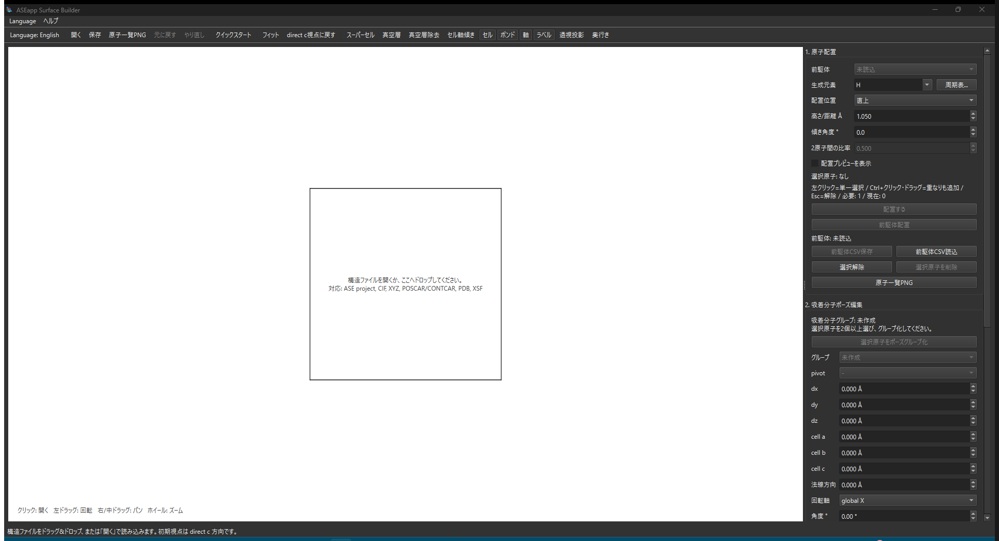

起動直後は中央キャンバスに「構造ファイルを開くか、ここへドロップしてください」と表示されます。

### 読み込み方法

| 方法 | 操作 |
| --- | --- |
| ツールバー | `開く` を押してファイルを選ぶ。ショートカットは `Ctrl+O`。 |
| ドラッグ&ドロップ | 構造ファイルをキャンバスへ直接ドロップする。 |
| 空画面から開始 | 起動直後の案内に従い、ファイルを開く。 |

### 読み込み対応形式

`POSCAR` / `CONTCAR` / `.vasp` / `.xyz` / `.extxyz` / `.cif` / `.pdb` / `.xsf` / `.json` / `.aseproj` / `.vesta`

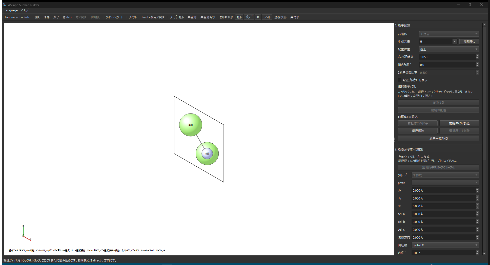

読み込み後は、初期視点が direct `c` 方向になります。表面 slab の上下を確認したい時は、まず `c` または `c*` 視点にしておくと作業しやすくなります。

### 保存

| 保存先 | 内容 |
| --- | --- |
| `.aseproj` / `.json` | ASEapp の編集情報を保持したプロジェクト形式。再編集向き。 |
| `POSCAR` / `CONTCAR` / `.vasp` / `.poscar` | VASP/POSCAR 形式。計算投入用。 |
| `.extxyz` / extended XYZ | ASE に cell / PBC / cartesian 座標を戻す用途。slab 連携の推奨形式。 |
| `.xyz` | 座標だけを渡す用途。通常 XYZ は cell / PBC を標準では保持しない。 |

保存は `保存` または `Ctrl+Shift+S` です。保存前に構造診断が表示されるため、原子数やセル状態を確認してから保存できます。

---

## 2. 画面構成


| 領域 | 役割 |
| --- | --- |
| 中央キャンバス | 構造を球・ボンド・セル枠で表示し、選択・視点移動・原子移動を行う。 |
| 上部ツールバー | ファイル操作、Undo/Redo、表示切替、supercell/vacuum など主要機能を実行する。 |
| 右パネル `1. 原子配置` | 元素選択、配置位置、プレビュー、前駆体、選択解除/削除を操作する。 |
| 右パネル `2. 吸着分子ポーズ編集` | 選択原子群を剛体グループ化し、並進・回転・結合長調整・ASE 出力を行う。 |
| 右パネル `3. スーパーセル/真空` | supercell、真空層、真空層除去、セル軸傾きを操作する。 |
| 右パネル `4. 視点操作` | direct/reciprocal 視点、操作モード、フィット、direct c リセットを操作する。 |
| ステータスバー | 現在の操作結果、選択状態、エラーなどを表示する。 |

### ツールバーの主要ボタン

| ボタン | 役割 |
| --- | --- |
| `Language: English` | 日本語/英語 UI を切り替える。 |
| `開く` | 構造ファイルを読み込む。 |
| `保存` | 編集中の構造を保存する。 |
| `原子一覧PNG` | 元素の球+ラベル画像を PNG 出力する。 |
| `元に戻す` / `やり直し` | 直前の構造編集を Undo/Redo する。 |
| `クイックスタート` | アプリ内の短い操作説明を開く。 |
| `フィット` | 構造全体が見えるように表示を合わせる。 |
| `direct c視点に戻す` | direct c 方向の標準視点へ戻す。 |
| `スーパーセル` | a/b/c 方向の繰り返し数を指定して supercell を作る。 |
| `真空層` | 真空層の追加/除去、slab 全体移動を行う。 |
| `真空層除去` | c 軸方向の余分な真空をすぐ詰める。 |
| `セル軸傾き` | セル軸を指定方向へ傾け、step-terrace 候補を作る。 |
| `セル` / `ボンド` / `軸` / `ラベル` | 表示のオン/オフを切り替える。 |
| `ボンド距離設定` | VESTA の `SBOND` 風に、元素ペアごとの表示ボンド距離 min/max Å を設定する。 |
| `透視投影` | 遠近感のある投影に切り替える。 |
| `奥行き` | 奥の原子を薄く見せる奥行き表現を切り替える。 |

### ボンド距離設定

`ボンド距離設定` では、`Cu-C` や `O-H` のような元素ペアを選び、表示するボンドの最小距離と最大距離を Å 単位で指定できます。VESTA 既定の `SBOND` 相当値を上書きし、設定は次回起動にも保存されます。2 原子を選択してから開くと、その 2 原子の元素ペアと距離が初期候補になり、現在距離を最大値として使えます。

---

## 3. 視点操作・選択・原子移動

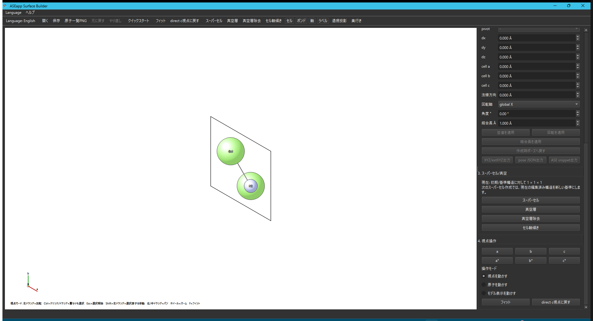

### 視点ボタン

| ボタン | 用途 |
| --- | --- |
| `a` / `b` / `c` | 実格子 direct a/b/c 方向から見る。 |
| `a*` / `b*` / `c*` | 逆格子 reciprocal a*/b*/c* 方向から見る。slab 面法線確認に便利。 |
| `フィット` | 全体が見えるようにズームを調整する。 |
| `direct c視点に戻す` | 初期に近い direct c 方向へ戻す。 |

通常の slab のように `c` 軸が ab 面法線と平行なセルでは、`c` と `c*` はほぼ同じ向きに見えます。非直交セルや `セル軸傾き` 後は、`c` と `c*` が異なる確認視点になります。

### マウス・キー操作

| 操作 | 内容 |
| --- | --- |
| 左ドラッグ | 視点回転。 |
| 右ドラッグ / 中ドラッグ | 画面をパン。 |
| ホイール | ズーム。 |
| 左クリック | 原子を単一選択。 |
| `Ctrl + 左クリック` | 選択を追加/解除。 |
| `Ctrl + 左ドラッグ` | 重なった奥の原子も追加選択。 |
| `Shift + 左ドラッグ` | 選択原子を画面平面内で移動。 |
| `Esc` | 選択解除。 |
| `Delete` | 選択中の原子を削除。 |
| `F` / ダブルクリック | フィット。 |
| `A` / `B` / `C` | direct a/b/c 視点。 |
| `Ctrl+Alt+A/B/C` | reciprocal a*/b*/c* 視点。 |
| `F1` | 使い方ヘルプ。 |

### 操作モード

| モード | 左ドラッグの意味 | 構造データへの影響 |
| --- | --- | --- |
| `視点を動かす` | 視点を回転する。`Shift+左ドラッグ` で選択原子を移動。 | 視点操作のみ。原子移動時は座標が変わる。 |
| `原子を動かす` | 選択原子の座標を直接移動する。 | 座標が変わる。 |
| `モデル表示を動かす` | 表示位置だけを動かす。 | 構造データは変わらない。 |

---

## 4. 原子配置

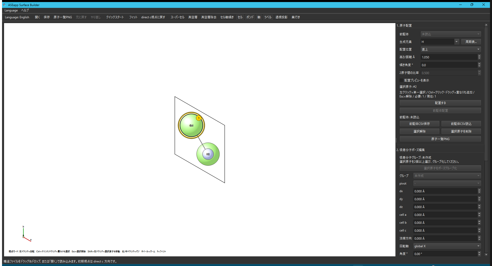

基本手順は、`選択 → 元素 → 配置位置 → 高さ/距離 → プレビュー確認 → 配置する` です。

1. キャンバスで基準にする原子を選択する。
2. `生成元素` に追加したい元素を入力または選択する。
3. 必要なら `周期表...` から元素を選ぶ。
4. `配置位置` を選ぶ。
5. `高さ/距離 Å`、`傾き角度 °` を調整する。
6. 位置確認が必要な時だけ `配置プレビューを表示` をオンにする。
7. `配置する` を押す。

### 周期表から元素を選ぶ

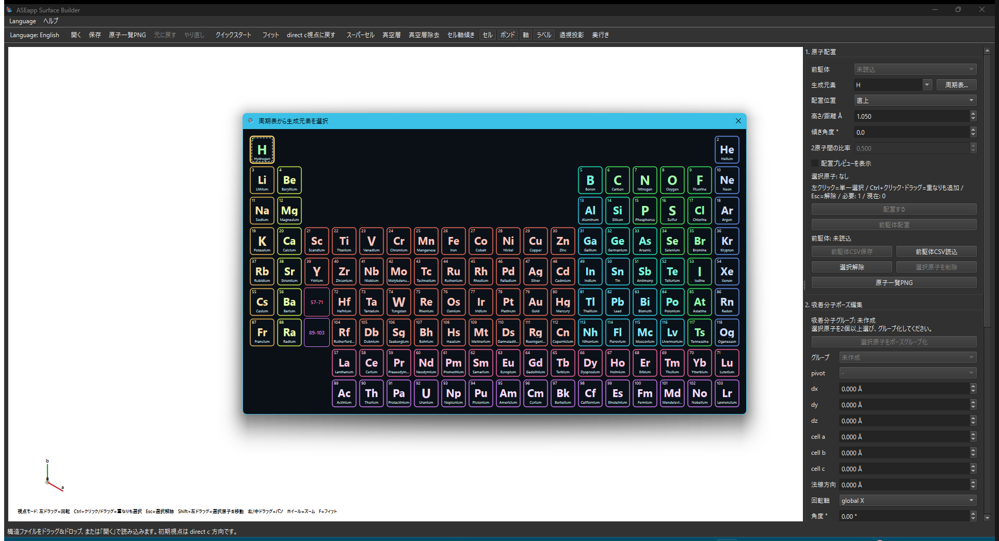

`周期表...` を押すと小型の周期表が開きます。元素を選択すると `生成元素` に反映されます。元素記号を直接入力することもできます。

### 配置位置の種類

| 配置位置 | 必要な選択数 | 動作 |
| --- | ---: | --- |
| `直上` | 1 個以上 | 選択原子の上側へ配置する。複数選択時は各原子に一括配置。 |
| `直下` | 1 個以上 | 選択原子の下側へ配置する。複数選択時は各原子に一括配置。 |
| `選択原子の中心` | 1 個以上 | 選択中の全原子の cartesian 座標平均に 1 個だけ配置する。2 原子、3 原子、4 原子以上でも同じ扱い。 |
| `選択面の法線上` | 3 個以上 | 選択原子で作る面の中心から、面法線方向に指定距離だけ離して配置する。 |

`高さ/距離 Å` は、基準点から法線方向へ動かす距離です。`0` にすると、選択原子中心または平面法線基準点そのものへ配置します。`傾き角度 °` は法線方向からの傾きで、2 個以上選択している場合は 1 個目から 2 個目の方向へ傾きます。

### 配置プレビュー


`配置プレビューを表示` をオンにすると、配置予定位置が半透明で表示されます。これは確認用の表示で、まだ実際の原子ではありません。誤って選択済み原子に見えないよう、通常はオフで使います。

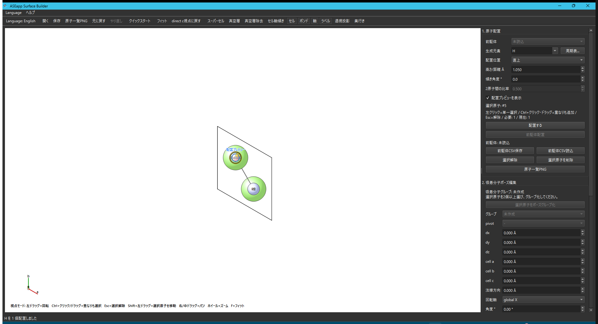

`配置する` を押すと実際の原子として追加されます。配置直後に想定と違った場合は、`元に戻す` で戻せます。

### 選択解除・削除

| 操作 | 内容 |
| --- | --- |
| `選択解除` / `Esc` | 選択中の原子をすべて解除する。 |
| `選択原子を削除` / `Delete` | 選択中の原子を一括削除する。 |
| `元に戻す` | 削除や配置を取り消す。 |

---

## 5. 前駆体 CSV の保存・読込・配置

前駆体は、複数原子のまとまりを CSV として保存し、別の配置位置へまとめて置く機能です。GaNH などの吸着前駆体を繰り返し置く作業に向いています。

### 保存

1. 前駆体として保存したい原子群を選択する。
2. `前駆体CSV保存` を押す。
3. 前駆体名を入力して CSV を保存する。

CSV は前駆体名、元素、相対座標だけを持ちます。

```csv
name,element,dx_angstrom,dy_angstrom,dz_angstrom
GaNH,Ga,0.000000,0.000000,0.000000
GaNH,N,0.000000,0.000000,1.950000
GaNH,H,0.000000,0.000000,2.950000
```

`dx/dy/dz` は、前駆体内で最も低い原子を基準にした Å 単位の相対座標です。

### 読込・配置

1. `前駆体CSV読込` で CSV を読み込む。
2. `前駆体` ドロップダウンから置きたい前駆体を選ぶ。
3. 通常の原子配置と同じように、配置先原子と `配置位置` を指定する。
4. `前駆体配置` を押す。

読み込んだ前駆体は `生成元素` とは別枠です。前駆体内で最も低い原子が、現在計算されている配置位置に来るように一括配置されます。

---

## 6. 吸着分子ポーズ編集

吸着分子ポーズ編集は、複雑な吸着分子の内部相対座標を崩さず、GUI 上で slab 上の向きだけを調整する機能です。ASE で大部分の構造を自動生成し、最後に 1 つの納得できるポーズを作って ASE に戻す用途に向いています。

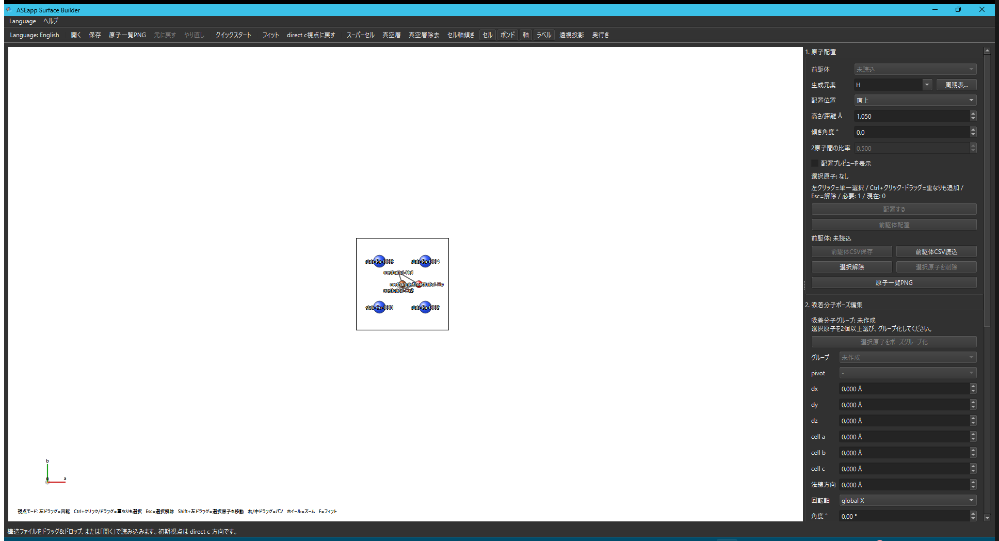

### 基本手順

1. 吸着分子として動かしたい原子群を選択する。
2. `選択原子をポーズグループ化` を押し、グループ名を付ける。
3. `グループ` で編集対象を選ぶ。
4. 必要な並進量、回転角、または目標結合長を入力する。
5. 確認したい時だけ `ポーズプレビューを表示` をオンにし、`プレビュー対象` で `並進` / `回転` / `結合長` を選ぶ。
6. 半透明の `ポーズプレビュー` で Apply 後の位置を確認する。実座標はまだ変更されない。
7. `並進を適用`、`回転を適用`、または `結合長を適用` を押す。
8. 結果が違う場合は `元に戻す` / `やり直し` で戻す。
9. ASE に戻す場合は `XYZ/extXYZ出力`、`pose JSON出力`、`ASE snippet出力` を使う。

### 剛体並進

| 入力 | 動作 |
| --- | --- |
| `dx` / `dy` / `dz` | cartesian 軸方向へ Å 単位で移動する。 |
| `cell a` / `cell b` / `cell c` | セル軸方向へ Å 単位で移動する。 |
| `法線方向` | slab 表面法線方向へ Å 単位で移動する。 |

並進はグループ全体に同じ変位を加えるため、分子内の結合長や相対座標は変わりません。奥行き方向を暗黙のカーソル位置で変えず、数値入力で明示的に動かすのが基本です。

### 剛体回転

| 項目 | 説明 |
| --- | --- |
| `pivot` | 固定点。グループ重心、質量中心、またはグループ内の各原子から選ぶ。 |
| `回転軸` | global X/Y/Z、cell a/b/c、slab 法線、選択中 2 原子の結合軸、画面手前方向から選ぶ。 |
| `角度 °` | 指定軸まわりに回す角度。 |

pivot 原子を選んだ場合、その原子座標は回転前後で変わりません。`選択中2原子の結合軸` を選んだ場合は、同じポーズグループ内で現在選択している先頭 2 原子を軸端点にし、その 2 原子は固定したまま軸外原子を回転します。

### ポーズプレビュー

`ポーズプレビューを表示` をオンにすると、現在の数値入力を Apply した後の吸着分子位置が半透明で表示されます。`プレビュー対象` は `並進`、`回転`、`結合長` から選べます。配置プレビューと同じく確認専用の表示なので、Apply ボタンを押すまで構造座標、Undo/Redo 履歴、保存内容は変わりません。

### 結合長調整

1. 同じポーズグループ内で、結合の両端 2 原子を選択する。
2. `結合長 Å` に目標値を入れる。
3. `結合長を適用` を押す。

通常は、2 個目に選んだ原子側の分子成分が結合方向へスライドします。環状分子など、対象結合を除いても分子グラフが分離しない場合は、可動側にしたい原子群も追加選択してください。

### ASE に戻す出力

| 出力 | 用途 |
| --- | --- |
| extended XYZ | 構造全体を cell / PBC 付きで ASE に戻す。slab 連携の推奨形式。 |
| 吸着分子のみの plain XYZ | GUI で調整した分子ポーズだけを別処理へ渡す。 |
| pose JSON | pivot、相対座標、回転、並進などのポーズメタデータを保存する。 |
| ASE snippet | `ase.io.read()` と `Atoms` を使い、別 slab / 別サイトへ同じポーズを展開するひな形。 |

通常 XYZ は cell / PBC を標準では保持しません。slab 全体を ASE へ戻す時は extended XYZ を選んでください。

---

## 7. スーパーセル作成

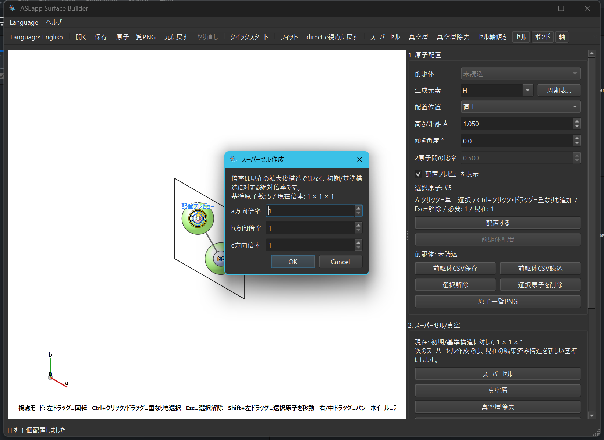

`スーパーセル` では、a/b/c 各方向の繰り返し数を指定して構造を拡張します。

| 項目 | 説明 |
| --- | --- |
| `a` | a 軸方向の繰り返し数。 |
| `b` | b 軸方向の繰り返し数。 |
| `c` | c 軸方向の繰り返し数。 |

表面計算では、まず `a` と `b` を大きくして表面面積を広げ、`c` は slab と真空層の扱いに合わせて決めるのが基本です。右パネルには現在の倍率と原子数が表示されます。次にスーパーセルを作る時は、現在の編集済み構造が新しい基準になります。

---

## 8. 真空層調整・真空層除去

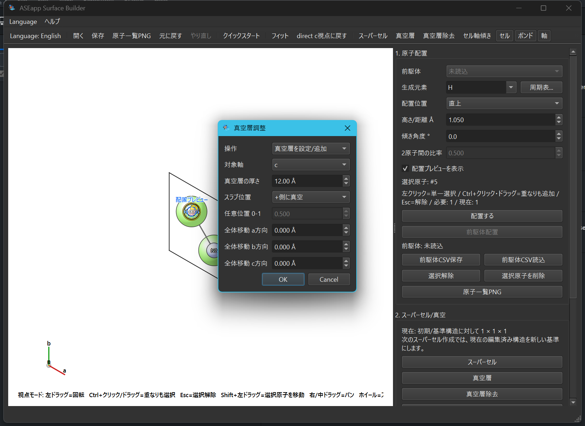

`真空層` では、真空層の追加/除去と slab 全体の平行移動をまとめて操作できます。

| 項目 | 説明 |
| --- | --- |
| `操作` | `真空層を設定/追加`、`選択軸の真空層をなくす`、`スラブ全体を移動のみ` から選ぶ。 |
| `対象軸` | 真空層を調整する軸。通常の表面 slab では `c` を選ぶ。 |
| `真空層の厚さ` | 追加/設定する真空層の厚さ。単位は Å。 |
| `スラブ位置` | `+側に真空`、`両側に均等`、`-側に真空`、`任意位置` から選ぶ。 |
| `任意位置 0-1` | 任意位置の時だけ使う。`0=-側`、`1=+側` に slab 中心を置く。 |
| `全体移動 a/b/c方向` | slab 全体を指定軸方向へ移動する。 |

### 使い分け

| 目的 | 推奨操作 |
| --- | --- |
| slab の上側に真空を作る | `真空層を設定/追加` + `対象軸 c` + `+側に真空`。 |
| slab をセル中央に置く | `真空層を設定/追加` + `両側に均等`。 |
| 余分な c 軸真空を素早く詰める | ツールバーまたは右パネルの `真空層除去`。 |
| 構造データを保ったまま slab 全体をずらす | `スラブ全体を移動のみ` で a/b/c 移動量を指定。 |

`真空層除去` は、c 軸方向の余分な真空層をなくし、セルを原子範囲に合わせるショートカットです。

---

## 9. セル軸傾き

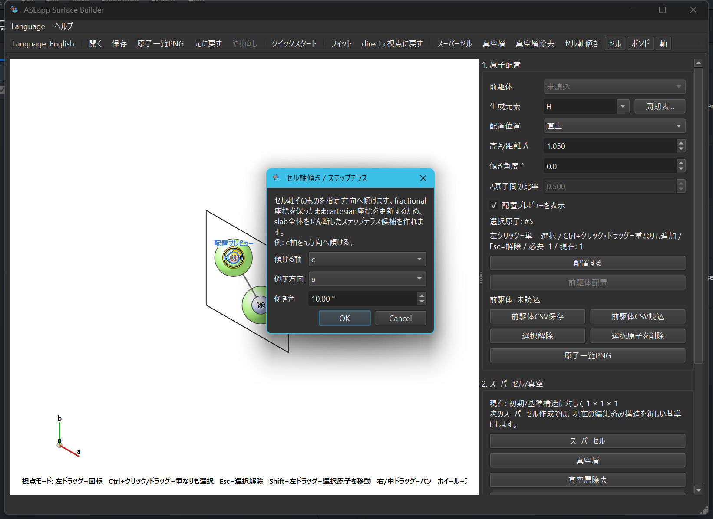

`セル軸傾き` は、セル軸そのものを別軸方向へ傾ける機能です。例えば `c` 軸を `a` または `b` 方向へ傾けると、step-terrace 候補を作りやすくなります。

| 項目 | 説明 |
| --- | --- |
| `傾ける軸` | 傾けたいセル軸。step-terrace では通常 `c`。 |
| `倒す方向` | 傾ける向き。例: `a` 方向へ傾ける。 |
| `傾き角` | 軸長を保ったまま傾ける角度。負値で逆方向。 |

傾けた後は `a/b/c` と `a*/b*/c*` の見え方が変わるため、必ず視点を切り替えて slab 面法線を確認してください。

---

## 10. 原子一覧 PNG 出力

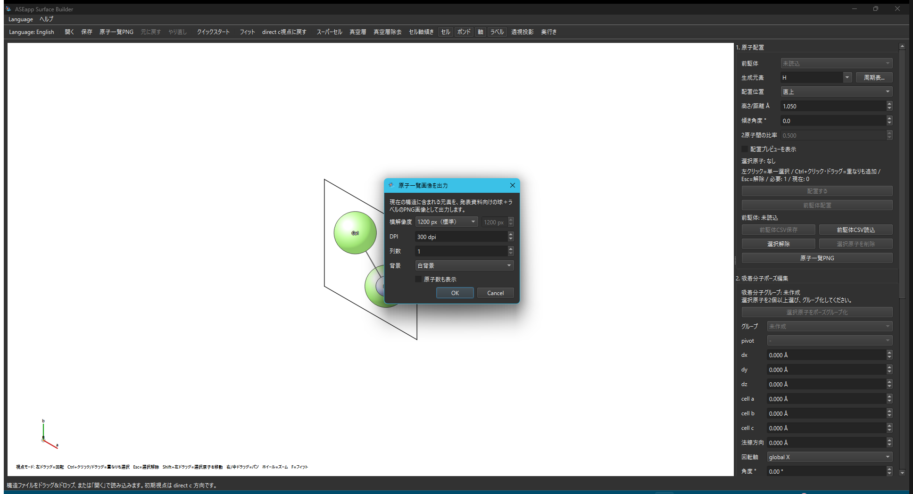

`原子一覧PNG` は、現在の構造に含まれる元素を球+ラベル画像として出力します。論文・学会スライド・説明資料に貼る凡例画像を作るための機能です。

| 項目 | 例 |
| --- | --- |
| 横解像度 | 800 / 1200 / 2000 / 4000 / カスタム。 |
| DPI | 画像の想定解像度。資料用途に合わせて指定。 |
| 列数 | 元素が多い時の並びを調整。 |
| 背景 | 白背景または透明背景。 |

透明背景を選ぶと、スライドや図に重ねやすくなります。

---

## 11. ヘルプ・クイックスタート

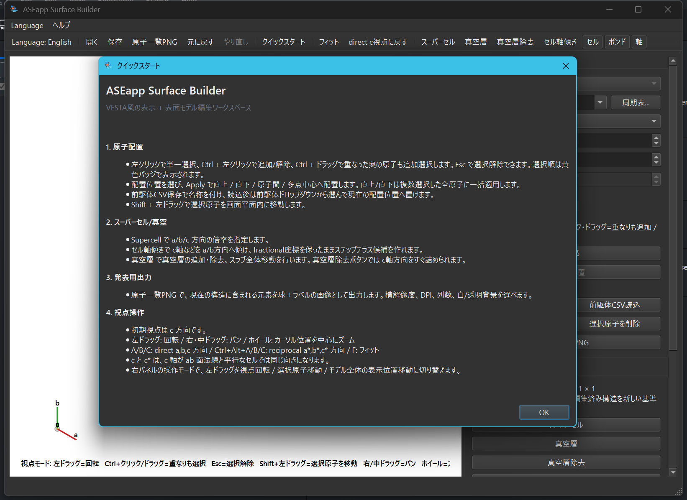

`クイックスタート` では、原子配置、supercell/vacuum、視点操作の要点をアプリ内で確認できます。`ヘルプ > 使い方` または `F1` から詳細ヘルプを開けます。`このアプリについて` ではアプリ概要を確認できます。

---

## 12. 目的別の作業例

### 吸着原子を表面原子の直上に置く

1. 表面原子を 1 個選択する。
2. `生成元素` を選ぶ。
3. `配置位置` を `直上` にする。
4. `高さ/距離 Å` を調整する。
5. `配置プレビューを表示` で確認する。
6. `配置する`。

### 複数選択した中心に置く

1. 基準にしたい表面原子を 2 個以上選択する。
2. `配置位置` を `選択原子の中心` にする。
3. 高さを `0` にすると、選択原子すべての cartesian 座標平均に置かれる。
4. 高さを入れると、中心から法線方向へずらして置かれる。
5. `配置する`。

2 原子の bridge site、3 原子の hollow site、4 原子以上の hollow site は、すべてこの `選択原子の中心` で扱います。

### 前駆体を複数箇所に置く

1. 前駆体 CSV を読み込む。
2. 配置先の原子または原子群を選択する。
3. 通常の配置位置を選ぶ。
4. `前駆体配置` を押す。

### 吸着分子の向きを GUI で調整して ASE へ戻す

1. ASE などで作った slab + 吸着分子構造を読み込む。
2. 吸着分子を構成する原子だけを選択する。
3. `選択原子をポーズグループ化` でグループを作る。
4. `dx/dy/dz`、cell 軸、法線方向で剛体並進する。
5. 必要なら `ポーズプレビューを表示` で Apply 後の並進・回転・結合長調整を確認する。
6. pivot と回転軸を選び、角度を指定して剛体回転する。
7. 結合を軸に回したい場合は、軸にしたい 2 原子を選択して `選択中2原子の結合軸` を使う。
8. `XYZ/extXYZ出力` または `ASE snippet出力` で ASE 側の大量 slab 生成に戻す。

### 表面モデルを広げて真空層を作る

1. `スーパーセル` で a/b を増やす。
2. `真空層` で対象軸 `c`、厚さを指定する。
3. `c` / `c*` 視点で slab と真空の向きを確認する。
4. 必要なら `真空層除去` で余分な空間を詰める。

---

## 13. トラブルシュート

| 症状 | 確認すること |
| --- | --- |
| 原子を置けない | `配置位置` に必要な選択数を満たしているか確認する。右パネルの「必要/現在」表示を見る。 |
| プレビューが見えない | 原子配置は `配置プレビューを表示`、ポーズ編集は `ポーズプレビューを表示` がオンか確認する。通常はどちらもオフ。 |
| 置いた原子が想定と違う | `元に戻す` で戻し、視点を `c` / `c*` にして再確認する。 |
| 重なった奥の原子を選びたい | `Ctrl+左クリック` または `Ctrl+左ドラッグ` を使う。 |
| 表示が重い | `ボンド`、`ラベル`、`奥行き`、プレビューを必要な時だけオンにする。supercell は必要最小限にする。 |
| slab の向きが分からない | direct `a/b/c` と reciprocal `a*/b*/c*` を切り替えて、面法線を確認する。 |
| 必要なボンドが出ない/余計なボンドが出る | `ボンド距離設定` で元素ペアごとの min/max Å を調整する。 |
| 保存形式で迷う | 後で再編集するなら `.aseproj`、計算投入なら POSCAR 系、ASE に cell / PBC 付きで戻すなら `.extxyz` を選ぶ。 |
| 結合軸回転できない | 同じポーズグループ内で、軸にしたい 2 原子を選択してから `選択中2原子の結合軸` を選ぶ。 |
| 結合長調整できない | 同じポーズグループ内で結合両端 2 原子を選ぶ。環状分子では可動側原子群も追加選択する。 |
| XYZ 保存で警告が出る | 通常 XYZ は cell / PBC を標準では保持しない。slab 全体を ASE に戻すなら extended XYZ を使う。 |

---

## 14. ショートカット早見表

| ショートカット | 機能 |
| --- | --- |
| `Ctrl+O` | 開く。 |
| `Ctrl+Shift+S` | 保存。 |
| `Ctrl+Z` | 元に戻す。 |
| `Ctrl+Y` / `Ctrl+Shift+Z` | やり直し。 |
| `Ctrl+Alt+L` | 原子一覧 PNG。 |
| `Ctrl+Alt+S` | スーパーセル。 |
| `Ctrl+Alt+V` | 真空層。 |
| `Ctrl+Alt+Shift+V` | 真空層除去。 |
| `Ctrl+Alt+T` | セル軸傾き。 |
| `F` | フィット。 |
| `Ctrl+R` | direct c 視点に戻す。 |
| `A/B/C` | direct a/b/c 視点。 |
| `Ctrl+Alt+A/B/C` | reciprocal a*/b*/c* 視点。 |
| `Esc` | 選択解除。 |
| `Delete` | 選択原子を削除。 |
| `F1` | 使い方ヘルプ。 |
